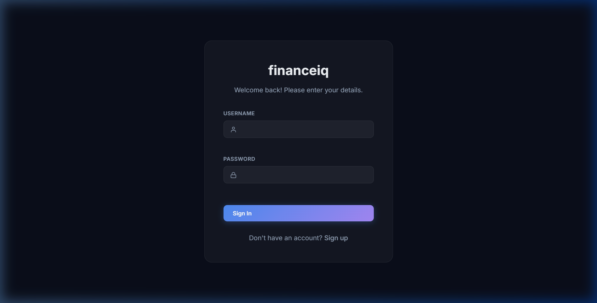
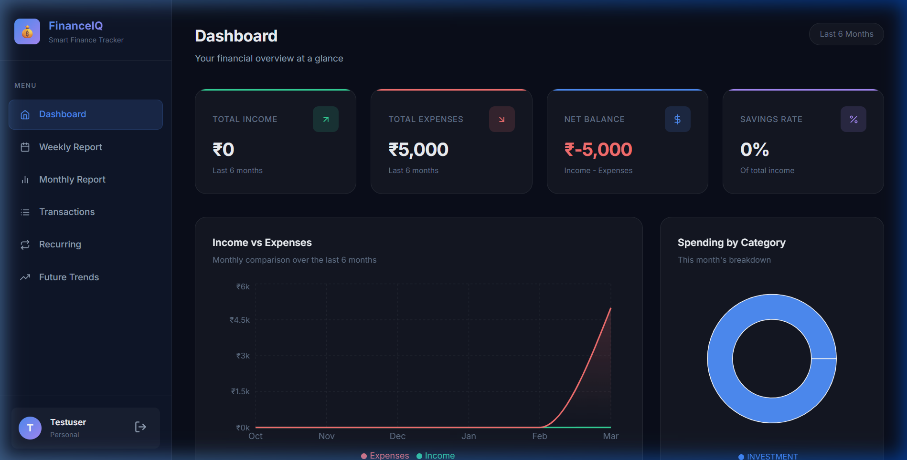
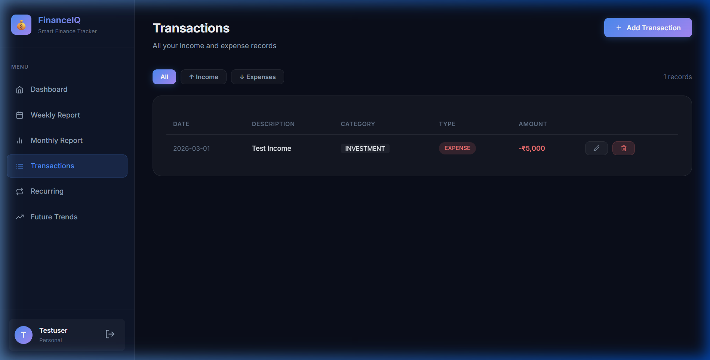
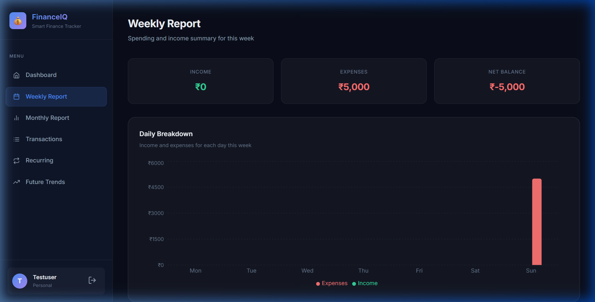
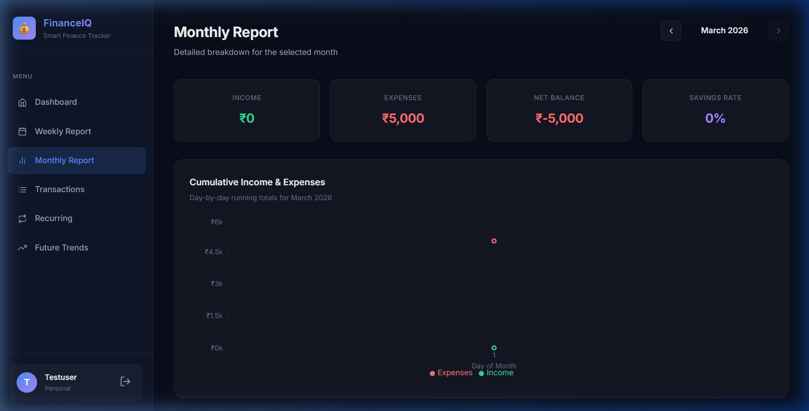
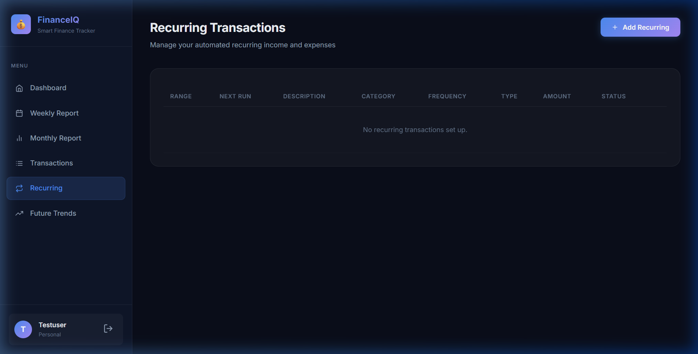
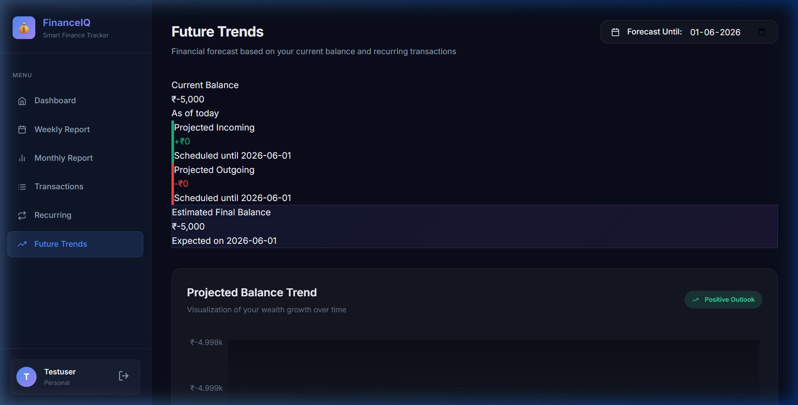

# 💰 FinanceIQ — Smart Finance Tracker

A full-stack personal finance application built with **Spring Boot** (backend) and **React + Vite** (frontend), featuring JWT authentication, MongoDB, and rich data visualizations.

---

## 🚀 Quick Start

### Prerequisites
- **Java 21** (JDK)
- **Node.js 18+**
- **MongoDB** running on `localhost:27017`

### Option A — One-command start (recommended)
```cmd
start-app.bat
```
This launches the backend on a dynamic port and starts the frontend automatically.

### Option B — Manual start

**Backend:**
```cmd
cd backend
gradlew.bat bootRun
```

**Frontend** (new terminal):
```cmd
cd frontend
npm install
npm run dev
```

> 🔑 A demo account is auto-seeded on first run: **username:** `demo` / **password:** `demo123`
> 📦 6 months of sample transactions are seeded automatically

---

## 📸 App Walkthrough

### 🔐 Login & Registration
Secure JWT-based authentication. Register a new account or use the demo credentials.



---

### 📊 Dashboard
Overview of your finances at a glance — KPI cards for total income, expenses, net balance and savings rate, plus an Income vs Expenses area chart and a Spending by Category donut chart.



---

### 💳 Transactions
View, add, edit and delete your income and expense records. Filter by type (All / Income / Expenses).



---

### 📅 Weekly Report
Day-by-day breakdown of the current week — daily bar chart, category spending progress bars, and a summary table.



---

### 📈 Monthly Report
Navigate month-by-month. Includes cumulative income/expense area chart, weekly breakdown bar chart, and category-wise spend listing.



---

### 🔁 Recurring Transactions
Manage recurring income or expenses (subscriptions, rent, salary, etc.) with configurable frequency (daily, weekly, monthly, yearly).



---

### 🔮 Future Trends
Project your future balance based on current recurring transactions. Pick a target date and see your projected income, expenses, and net balance.



---

## 🏗️ Tech Stack

| Layer | Technology |
|-------|-----------|
| Backend | Java 21, Spring Boot 3, Spring Security, JWT |
| Database | MongoDB |
| Frontend | React 18, Vite, Recharts, Axios |
| Auth | JWT (stateless, 10-hour tokens) |

## 📋 API Endpoints

| Method | URL | Description | Auth |
|--------|-----|-------------|------|
| POST | `/api/auth/register` | Register new user | Public |
| POST | `/api/auth/login` | Login, get JWT token | Public |
| GET | `/api/reports/dashboard` | KPI summary + monthly trend | 🔒 |
| GET | `/api/reports/weekly` | This week's daily breakdown | 🔒 |
| GET | `/api/reports/monthly?month=3&year=2026` | Monthly detailed report | 🔒 |
| GET | `/api/reports/future-projection?targetDate=2026-12-31` | Future balance projection | 🔒 |
| GET | `/api/transactions` | All transactions | 🔒 |
| POST | `/api/transactions` | Add transaction | 🔒 |
| PUT | `/api/transactions/{id}` | Update transaction | 🔒 |
| DELETE | `/api/transactions/{id}` | Delete transaction | 🔒 |
| GET | `/api/recurring-transactions` | All recurring items | 🔒 |
| POST | `/api/recurring-transactions` | Add recurring item | 🔒 |
| PUT | `/api/recurring-transactions/{id}` | Update recurring item | 🔒 |
| DELETE | `/api/recurring-transactions/{id}` | Delete recurring item | 🔒 |
| GET | `/api/users/profile` | Get user profile | 🔒 |
| POST | `/api/users/profile-picture` | Upload profile picture | 🔒 |

[](https://sonarcloud.io/summary/new_code?id=harshadgeek_financialApp)
